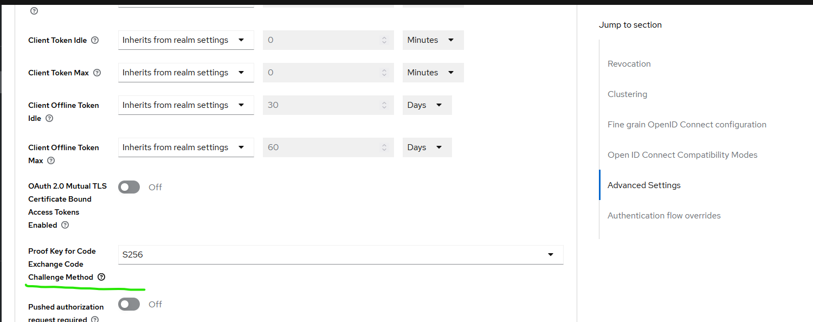
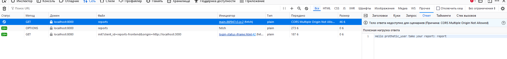
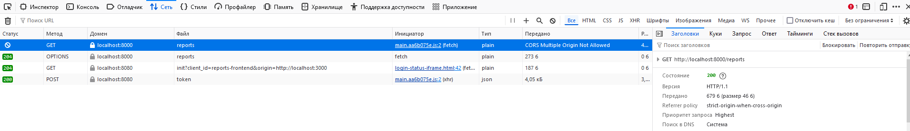
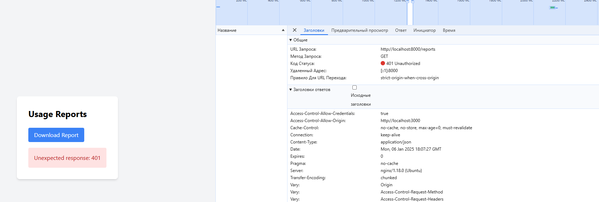

План по запуску:
1) в корневой папке  docker-compose up --build -d
2) Если сразу не стартанет back надо его растартануть, потому что для старта он должен пингануть keycloak
3) возможно потребуется включить в keycloak настройку для pkce
 
4) 
Запрос и проверка работает. Хотя есть ошибка cors(но ее починка не является целью задания)

Заголовок 200 виден

Несмотря на ошибку cors проверка авторизации все равно сохраняется
Заголовок 401 виден

Проверено на wsl ubuntu 20.04